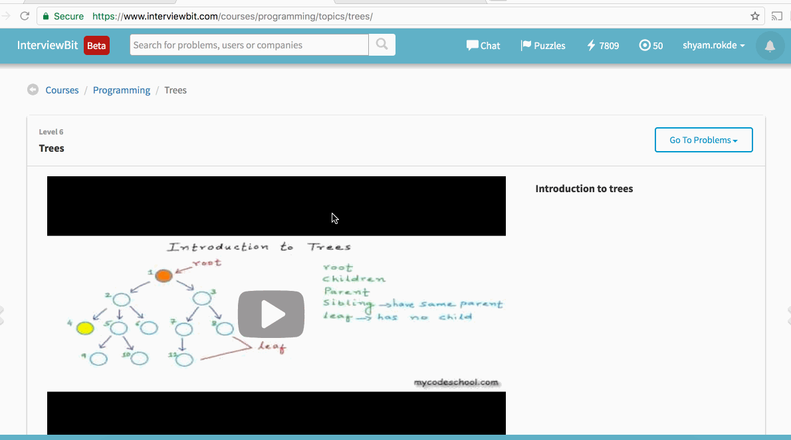

# CodePath Solutions for week 3 assignment 

## Trees

* Trees - Inorder Traversal - [InorderTraversal.java] (./trees/InorderTraversal.java) - https://www.interviewbit.com/problems/inorder-traversal/
* Trees - Max Depth Of Binary Tree - [MaxDepthBinaryTree.java] (./trees/MaxDepthBinaryTree.java) - https://www.interviewbit.com/problems/max-depth-of-binary-tree/

##  Binary Search

* Binary Search - 

## Video Walkthrough 

Here's a walkthrough of completed *week 3 assignment*:

GIF created with [LiceCap](http://www.cockos.com/licecap/).