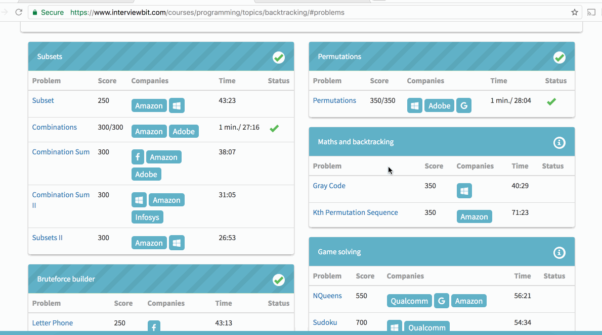

# CodePath Solutions for week 4 assignment 

## Recursion

* Recursion - Combinations - [Combinations.java] (./recursion/Combinations.java) - https://www.interviewbit.com/problems/combinations/
* Recursion - Palindrome Partitioning - [PalindromePartitioning.java] (./recursion/PalindromePartitioning.java) - https://www.interviewbit.com/problems/palindrome-partitioning/

## Bit Manipulation

* Bit Manipulation - Number Of 1 Bits - [NumberOfBits.java] (./bit_manipulation/NumberOfBits.java) - https://www.interviewbit.com/problems/number-of-1-bits/
* Bit Manipulation - Single Number - [SingleNumber.java] (./bit_manipulation/SingleNumber.java) - https://www.interviewbit.com/problems/single-number/

## Video Walkthrough 

Here's a walkthrough of completed *week 4 assignment*:

GIF created with [LiceCap](http://www.cockos.com/licecap/).